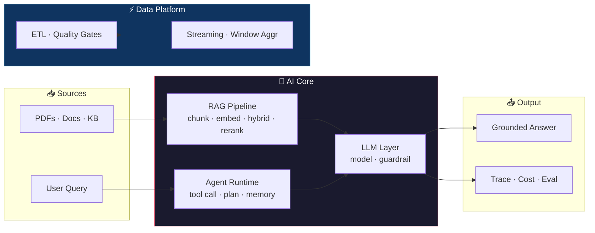

<div align="center">


# 👋 Hi, I'm Xin Liu (Leon)

### AI Engineer · Building Production-Grade LLM Systems That Actually Ship

**RAG · AI Agents · Tool Calling · Data Pipelines · Streaming**


*"AI that doesn't just demo — it deploys."*

</div>

---

## 🧭 What I Do

I build **end-to-end AI systems** that go from raw documents to grounded answers, from a user request to a tool that gets the job done. Not toy demos — **production-grade, deployed, and measured**.

| Pillar | What I build | Why it matters |
|--------|-------------|----------------|
| **RAG (Retrieval-Augmented Generation)** | Enterprise knowledge bases, document Q&A with citations | Every company needs to answer questions from its own data |
| **AI Agents** | Agents that call tools, plan, and complete tasks | The shift from chatbots to agents that *do* work |
| **Data Platform** | ETL pipelines, real-time streaming, data quality | AI is only as good as the data behind it |

---

## 🔥 Flagship Projects

### 🤖 Enterprise RAG Platform — `rag-bot-backend`
**Hybrid retrieval + reranking + guardrail + eval + multi-tenant.**

> The centerpiece. A production-grade RAG backend with **4 real business scenarios**: customer support, internal wiki, product docs, and ticket auto-resolution. 2,700+ lines, 23 files, Docker-deployable.

```
User Query → Hybrid Search (Vector + BM25) → Cross-Encoder Rerank
         → Guardrail (pre/post) → LLM → Grounded Answer + Citations
```

**The engineering depth interviewers care about:**
- **Hybrid retrieval** — vector + BM25 ensemble (0.6/0.4), because pure semantic search misses exact terms
- **Reranking** — Cross-Encoder, Top-20 → Top-5
- **Guardrails** — pre-check (is context relevant?) + post-check (is answer grounded?) to kill hallucination
- **Eval harness** — Context Precision / Faithfulness / Answer Relevancy; every param change re-validated
- **Multi-tenant isolation** — namespace + row-level; the one bug that leaks data across tenants
- **Production stack** — Chroma→Pinecone switchable, SQLite→PostgreSQL, in-memory→Redis, Celery async

### 🧠 AI Agent — `llm-agent`
**ReAct loop + tool calling + memory + error handling.**

An agent that doesn't just chat — it **calls tools to complete tasks**: calculator, web search, knowledge base, database. Structured trace of every step. Self-corrects on malformed tool args via Pydantic validation.

### 🤝 Multi-Agent System — `multi-agent-system`
**Orchestrator + specialist agents (Research / Writer / Critic).**

A content pipeline: research → write → critique → revise. Shows you understand **agent collaboration**, not just single-agent loops.

### 📊 Data Pipeline — `data-pipeline-etl`
**Extract → Transform → Validate → Load.**

Clean-null, normalize, add-timestamp, quality-gate with error tracking. The "boring" data engineering that makes AI work.

### ⚡ Streaming Data Platform — `streaming-data-platform`
**Real-time window aggregations over WebSocket.**

Events in → process in real-time → query via API → live dashboard. 

### 🛠 Tool Calling — `tool-calling-demo`
**Production function-calling patterns**: weather, order status, calendar, email — with clean schema + multi-turn.

---

## 🏗️ Architecture at a Glance



---

## 🛠️ Tech Stack

| Layer | Tools |
|-------|-------|
| **AI / LLM** | OpenAI · LangChain · RAG · ReAct Agents · Function Calling · Guardrail · Eval |
| **Backend** | FastAPI · Python · SQLAlchemy · JWT Auth |
| **Data** | ETL · PostgreSQL · SQLite · Redis · Celery · Real-time Streaming |
| **Vector** | Chroma (dev) · Pinecone (prod) · Hybrid + Cross-Encoder Rerank |
| **Infra** | Docker · docker-compose · Structured Logging · Metrics |

---

## 📊 By the Numbers

```
6 production projects   ·   2,700+ lines in flagship RAG backend
4 real business scenarios ·   Hybrid + Rerank + Guardrail + Eval
Docker-deployable          ·   Full-stack (API + frontend)
```

---

## 📬 Let's Talk

I'm actively looking for **remote AI / full-stack roles** (worldwide) and **freelance AI projects**.

- **GitHub:** [@LeonxLJX](https://github.com/LeonxLJX)
- **Email:** liuzhaoxing373@gmail.com
- **Focus:** RAG · AI Agents · Data Pipelines · Full-Stack AI

<div align="center">
<sub>AI Engineer · Xin Liu (Leon) · Master's in Finance, WorldQuant</sub>
</div>
