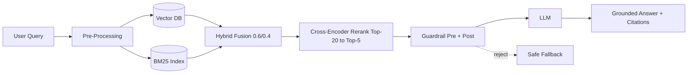
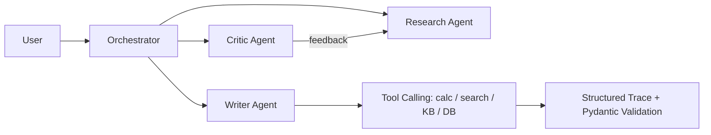

# 👋 Hi, I'm Stella (Liu Xin)

**AI Engineer · Building Production-Grade RAG, Agents & Data Systems**

`RAG` · `AI Agents` · `Tool Calling` · `Data Pipelines` · `Streaming`

> *"AI that doesn't just demo — it deploys, measures, and ships."*

---

## 🧭 What I Do

I design and build **end-to-end AI systems** that turn raw documents into grounded, cited answers — and user requests into tools that actually get work done. Not toy demos: production-grade, deployed, evaluated, and measured.

| Pillar | What I Build | Why It Matters |
|---|---|---|
| **RAG** | Enterprise knowledge bases, document Q&A with citations | Every company must answer questions from its own data |
| **AI Agents** | Agents that call tools, plan, and finish tasks | The shift from chatbots to agents that *do work* |
| **Data Platform** | ETL, real-time streaming, data quality | AI is only as good as the data behind it |

---

## 🏗️ System Architecture

---

## 🔥 Flagship Projects

### 1. Enterprise RAG Platform — rag-bot-backend
**Hybrid retrieval + reranking + guardrails + eval + multi-tenant.**
Production-grade RAG backend across **4 real business scenarios** (support, wiki, product docs, ticket resolution). **2,700+ lines, 23 files, Docker-deployable.**

**Why it's hard (and how I solved it):**
- **Hybrid retrieval 0.6/0.4** — pure semantic search misses exact terms; I fused vector + BM25.
- **Rerank Top-20 → Top-5** — Cross-Encoder to cut noise before the LLM.
- **Hallucination guardrails** — pre-check (is context relevant?) + post-check (is answer grounded?) to kill hallucinations.
- **Eval harness** — Context Precision / Faithfulness / Answer Relevancy; every param change re-validated.
- **Multi-tenant isolation** — namespace + row-level; the one bug that leaked data across tenants.

### 2. AI Agent — llm-agent
ReAct loop + tool calling + memory + error handling. An agent that **calls tools** (calculator, web search, KB, DB) with a structured trace and self-correction via Pydantic validation.

### 3. Multi-Agent System — multi-agent-system
Orchestrator + specialist agents (Research / Writer / Critic). A content pipeline that shows **agent collaboration**, not just single loops.

### 4. Data Pipeline — data-pipeline-etl
Extract → Transform → Validate → Load. Clean-null, normalize, add-timestamp, **quality-gate with abort-on-fail**, idempotent loading, full lineage.

### 5. Streaming Data Platform — streaming-data-platform
Real-time window aggregations over WebSocket. Events in → process → query via API → live dashboard.

### 6. Tool Calling — tool-calling-demo
Production function-calling patterns (weather, order, calendar, email) with clean schema + multi-turn.

---

## 🛠️ Tech Stack

| Layer | Tools |
|---|---|
| AI / LLM | OpenAI · LangChain · RAG · ReAct Agents · Function Calling · Guardrail · Eval |
| Backend | FastAPI · Python · SQLAlchemy · JWT Auth |
| Data | ETL · PostgreSQL · SQLite · Redis · Celery · Real-time Streaming |
| Vector | Chroma (dev) · Pinecone (prod) · Hybrid + Cross-Encoder Rerank |
| Infra | Docker · docker-compose · Structured Logging · Metrics |

---

## 💪 Hard Problems I've Solved

- **Hallucination in RAG** → built pre/post guardrails + eval harness; grounded answers with citations.
- **Data leakage across tenants** → namespace + row-level isolation; fixed the multi-tenant bug.
- **Agent tool-call failures** → Pydantic validation + self-correction on malformed args.
- **ETL quality failures** → abort-on-fail quality gates + idempotent loading + full lineage.

---

## 📊 By the Numbers

6 production projects · 2,700+ lines in flagship RAG backend · 4 real business scenarios · Hybrid + Rerank + Guardrail + Eval · Docker-deployable · Full-stack (API + frontend)

---

## 📬 Let's Talk

I'm actively looking for **remote AI / full-stack roles (worldwide)** and freelance AI projects.

**GitHub:** @LeonxLJX · **Email:** liuzhaoxing373@gmail.com
**Focus:** RAG · AI Agents · Data Pipelines · Full-Stack AI
