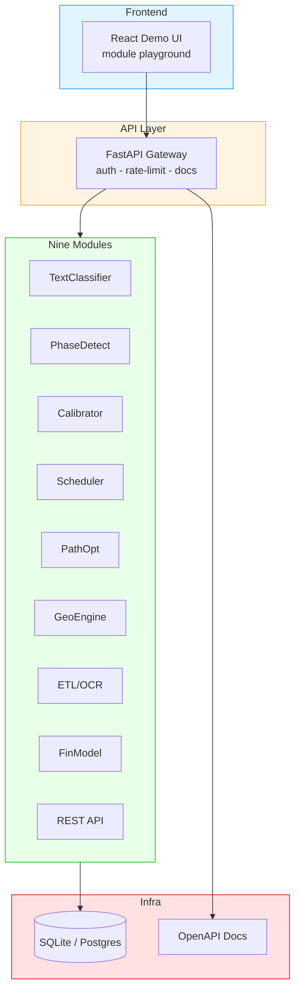

<div align="center">


# ⚡ AgentX
### Nine-Module Full-Stack AI Engineering Toolkit

**One repo. Nine production-ready AI modules. REST API + React frontend + one-command Docker.**


*Built for engineers who ship — not decks.*

</div>

---

## 🚀 What is AgentX?

AgentX is a **modular full-stack AI system** that packages nine recurring high-value engineering tasks into independently deliverable, demo-ready modules. Every module ships behind the same clean **REST API + React demo UI + Docker deployment**, so you can go from "here's what I can do" to "here's it running" in under five minutes.


> 🎯 **Built around real project work**: text classification, NLP phase detection, probability calibration, job scheduling, path optimization, computational geometry, ETL/OCR pipelines, financial modeling, and a full-stack API layer.

---

## 🏗️ Architecture



---

## 📦 The Nine Modules

| # | Module | What it does | Tech stack |
|---|--------|--------------|------------|
| 1 | **Text Classifier** | Multi-class EN/ZH text classification | TF-IDF - LogReg - SVM - scikit-learn |
| 2 | **Phase Detector** | Sentiment + topic + entity extraction | Lexicons - TF-IDF - KMeans - regex |
| 3 | **Calibrator** | Probability calibration (Platt / Isotonic) + reliability diagrams | scikit-learn - Brier - log-loss |
| 4 | **Scheduler** | Job scheduling, WSPT priorities, parallel machines | Kahn sort - priority queues |
| 5 | **Path Optimizer** | Shortest path / routing optimization | NetworkX - heuristic search |
| 6 | **Geo Engine** | Computational geometry - spatial queries | shapely - SciPy |
| 7 | **ETL / OCR** | Multi-source ingestion, cleaning, quality gates, OCR | pandas - SQLAlchemy - OCR |
| 8 | **Financial Model** | Time-series forecasting, risk metrics, portfolio analytics | statsmodels - pandas - numpy |
| 9 | **REST API** | Full OpenAPI layer - every module as an endpoint | FastAPI - Pydantic - Docker |

---

## ✨ Highlights

- 9 independent modules - demo one, quote one, deliver one
- One-command Docker - `docker-compose up` and the whole stack is live
- Tested - every module has unit tests + example inputs
- OpenAPI docs - interactive Swagger UI out of the box
- Modular by design - add your own module by dropping a folder

---

## 🖥️ Development Workflow


---

## 🏃 Quick Start

```bash
# Clone
git clone https://github.com/LeonxLJX/AgentX.git
cd AgentX

# Run with Docker (recommended)
docker-compose up --build

# Or run locally
pip install -r requirements.txt
uvicorn agentx.main:app --reload
```

Then open:

| What | URL |
|------|-----|
| Demo UI | http://localhost:8000 |
| API Docs (Swagger) | http://localhost:8000/docs |
| Health check | http://localhost:8000/health |

---

## 📁 Project Structure

```
AgentX/
├── agentx/           # core package
│   ├── modules/      # the 9 modules, one folder each
│   ├── api/          # FastAPI routes + schemas
│   └── core/         # config, logging, persistence
├── examples/         # sample inputs + outputs
├── tests/            # unit tests
├── docs/             # architecture notes
├── tools/            # scripts & utilities
└── docker-compose.yml
```

---

## Tech Stack

| Layer | Tools |
|-------|-------|
| **Language** | Python 3.10+ |
| **API** | FastAPI - Pydantic - Uvicorn |
| **ML / AI** | scikit-learn - pandas - numpy - SciPy - statsmodels |
| **Data** | SQLite - SQLAlchemy - pandas |
| **Infra** | Docker - docker-compose |
| **Quality** | pytest - ruff - mypy |

---

## About

This project is a demonstration of end-to-end AI engineering: from data ingestion and model selection, through API design and testing, to containerized deployment and a working demo UI.

Built by **Xin Liu (Leon)** - AI & full-stack engineer. Master's in Finance (WorldQuant). I build LLM agents, RAG systems, and data pipelines that ship.

GitHub: [@LeonxLJX](https://github.com/LeonxLJX)

---

<div align="center">
<sub>If this project helps you, give it a star.</sub>
</div>
